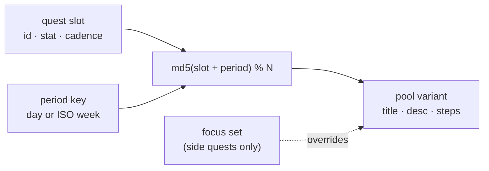
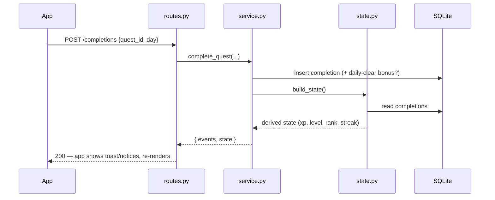

# ARISE — The System · Design Document

A Solo Leveling-inspired personal progression system. One Player, five areas of
life, one goal: become your best version by showing up — at whatever pace you can.

## Philosophy — a guide, not a taskmaster

Every feature and every line of copy is checked against this:

- **Invite, don't command.** Quests are invitations toward who you want to be.
  No "must", no "non-negotiable". A good day is that you showed up at all.
- **Discipline, gently.** Small and consistent beats fast and forced. Celebrate
  any progress, not just perfect days.
- **Forgiveness is built in.** Rest days keep your streak; a missed day is never
  framed as failure. There are deliberately **no punishment mechanics**.
- **Keep the why in view.** The player's North Star sits atop the Status screen.
- **Room to live.** Rest and enjoying life are part of the path, not a detour.

## The Five Hobbies (Party Composition)

| Slot | Hobby | Stat | Notes |
|---|---|---|---|
| Healthy | Badminton + daily conditioning | **STR** | Sessions are "dungeon raids"; daily conditioning feeds them |
| Creative | Drawing, music (FL Studio), photo/video | **CRE** | Visible output, cheap to start |
| Peaceful | Meditation | **SPI** | Calm, focus, reflection, breath — 10 min baseline |
| Connect | Social quests | **CHA** | Weekly gathering + daily micro-connections (ambivert-friendly) |
| Grow | Coding, math, Japanese, reading, the world | **INT** | Building this app counts; also history/science/politics/geography |

Time budget: 30 min–2 hrs/day. Minimum daily loop ≈ 65 minutes.

## Quests

- **Daily Quests** — one per stat, 10 XP each. Completing all five grants a
  **+15 XP Daily Clear bonus**.
- **Weekly Quests** — the raids. Badminton ×2/week (40 XP each), one hangout
  (50 XP), one finished drawing (40 XP), 3 book chapters (40 XP), one 30-min
  meditation (30 XP). Reset every Monday (ISO week).
- **Side Quests** — optional, 15 XP, each completable once per day.

The 15 quests are stable **slots** (`quest_defs` table, seeded by
`backend/app/seed.py`): their id, stat, xp, cadence and target never change — so
completions, streaks and achievements keep counting. What rotates is each slot's
title/description/steps.

## Rotating content & coaching steps

`backend/app/quests.py` holds a hand-written pool of variants per slot. The
variant shown is chosen by `md5(slot + period)` — the day for daily/side quests,
the ISO week for weekly ones — so the board is stable within a period and fresh
next period. Deterministic, offline, free (no LLM).

Each variant carries **steps**: concrete instructions (reps × sets, timed
segments, prompts). For single-completion quests these render as a **tickable
checklist** (`step_checks` table, scoped to the period). Ticking the last step
auto-completes the quest — with a floating toast + undo — and the completion
circle fills proportionally as steps are ticked. Multi-session quests (e.g.
badminton ×2) keep steps as guidance and the tap-to-log flow.

## Focus areas (personalization)

Each attribute has an optional **set of focuses** (`preferences` table; the
`focus` column stores a JSON list). A saved focus rotates that attribute's *side
quest* through the set day to day (`Your focus: …`). Free, keyword-simple; the
architecture leaves room to swap in LLM-generated quests later without changing
the slot model.

## North Star

A free-text line the player writes (`players.north_star`) about the life they're
reaching for — pinned to the top of the Status screen as their reason.

## Rest & forgiveness

A **rest day** records a `rest-day` completion: it earns no XP and isn't a quest
completion, but it counts as an active day, so the streak survives. The current
streak also has a one-day grace (yesterday's streak isn't "broken" while today is
still in progress). Ranks use *best-ever* streak, so they never regress.

## XP & Levels

- Hunter level: XP to go from level *n* to *n+1* is `80 + (n−1)·40`.
  Early levels come fast (motivation), later ones feel earned.
- Stats level independently on a cheaper curve: `50 + (n−1)·30`.
- The Daily Clear bonus counts toward hunter XP only, not stats.

## Ranks (E → S)

Rank requires **level + best-ever streak**, so consistency can't be skipped:

| Rank | Level | Best streak |
|---|---|---|
| E | 1 | — |
| D | 10 | 7 days |
| C | 20 | 14 days |
| B | 32 | 21 days |
| A | 46 | 30 days |
| S | 60 | 50 days |

A streak day = any day with at least one quest completion. The current streak
survives until end of today (yesterday's streak isn't "broken" while today is
still in progress).

## Achievements & Titles

Defined in `backend/app/achievements.py` as pure predicates over a progress
snapshot. Some grant equippable **titles** shown on the status window
(e.g., "The Awakened", "Iron-Willed", "Shuttlecock Slayer").

## Architecture (API-first)

Completing a quest, end to end:

- The server is the source of truth; the app renders one `GET /state` payload.
- `POST /completions` returns **events** (daily clear, level up, rank up,
  achievement) which the app shows as System pop-ups.
- The client sends its local date with every call — the phone knows what
  "today" means better than the server does.
- The `completions` table is the source of truth; XP totals, streaks, and
  achievements are derived from it on read.
- **Backend modules split by concern:** `routes.py` (thin HTTP) → `state.py`
  (read model: derives the state payload from rows) and `service.py` (write
  operations). Pure rules live in `game.py`; quest content in `quests.py`.
- **Durability:** SQLite runs in WAL mode; a launchd job snapshots the DB daily
  (`scripts/backup_db.py` → `backend/backups/`, last 30). Tested with pytest
  (unit + integration + migration).
- **Scaling path:** swap `ARISE_DATABASE_URL` to Postgres; every table already
  carries `player_id`, so multi-user is additive. The honest tradeoff of
  API-first: the app needs the server reachable (an offline queue is a
  possible future patch).

## Design Language — "sandy" minimal

Restraint is the aesthetic. Simplicity comes from taking things away, not from
stacking trends (an earlier glass/glow/gradient version read as generic
"AI-designed" — this replaced it).

- **Warm and flat** — a sand page (`#F0E8D8`), ivory cards, espresso text. No
  gradients, glows, blur, neon, or bracketed corners. Cards are a 1px warm
  hairline and nothing more.
- **One accent** — a muted clay (`#B0603A`), used sparingly (progress fills,
  the active tab, primary buttons). Stats use desaturated earthy tones
  (clay, ochre, sage, mauve, slate) so five categories stay legible without
  shouting.
- **Type does the work** — system sans, two weights (regular + semibold),
  sentence case everywhere (no ALL-CAPS labels, no wide letter-spacing).
  Hierarchy comes from size and spacing.
- **Semantic tokens** — components consume roles (`surface.card`,
  `text.secondary`, `accent`), never raw hex.
- **Quiet motion** — XP bars ease on change; quest cards tint on press; the
  System notice springs in gently. Never decorative.

## Roadmap (patches)

- v2.1 — Daily reminder notifications (needs a dev build; Expo Go limits these)
- v2.2 — History / calendar view of past days
- v2.3 — Boss fights (milestone quests) and more titles — encouragements, never
  penalties (the philosophy rules out punishment for missed days)
- v3.0 — Standalone installed builds (Android APK, iOS via Xcode); cloud deploy
  of the backend for anywhere-access
