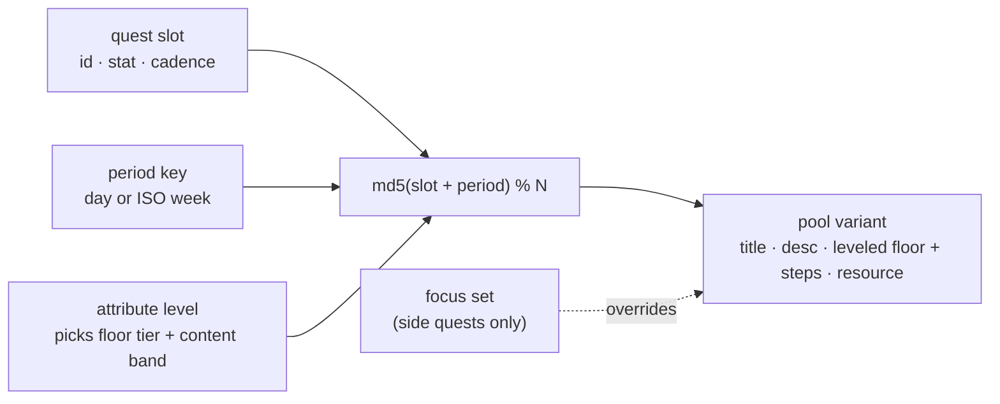
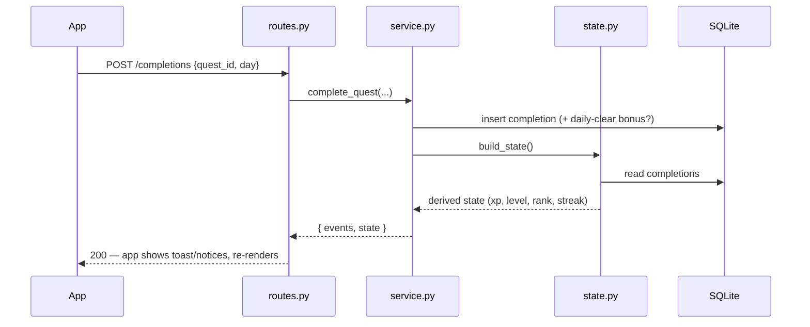

# ARISE — The System · Design Document

A Solo Leveling-inspired personal progression system. One Player, seven areas of
life, one goal: become your best version by showing up — at whatever pace you can.

## Philosophy — a guide, not a taskmaster

Every feature and every line of copy is checked against this:

- **Invite, don't command.** Quests are invitations toward who you want to be.
  No "must", no "non-negotiable". A good day is that you showed up at all.
- **Discipline, gently.** Small and consistent beats fast and forced. Celebrate
  any progress, not just perfect days.
- **Forgiveness is built in.** Rest days keep your streak; a missed day is never
  framed as failure. There are deliberately **no punishment mechanics**.
- **Keep the why in view.** The player's North Star sits atop the Status screen.
- **Room to live.** Rest and enjoying life are part of the path, not a detour.

## The Seven Attributes (Party Composition)

| Slot | Hobby | Stat | Notes |
|---|---|---|---|
| Healthy | Badminton + conditioning | **STR** | Sessions are "dungeon raids"; the daily rotates its conditioning but always opens with a push-ups + plank floor that *climbs with your level* (see Progression), tuned for toning, not bulk |
| Creative | Drawing, dance, music (FL Studio), photo/video | **CRE** | Visible output, cheap to start |
| Peaceful | Meditation | **SPI** | Calm, focus, reflection, breath — 10 min baseline |
| Connect | Social quests | **CHA** | Weekly gathering + daily micro-connections (ambivert-friendly) |
| Grow | Math, Japanese, reading, the world | **INT** | Reads a book a week (a chapter a day is the mandatory floor); the rest — learn-how-to-learn/math/Japanese/history/science — rotates on top |
| Wealth | Making money | **WLT** | Fundamentals, side income, monetising your skills, and managing/growing money |
| Craft | Coding → Senior | **CFT** | The engineering ladder: fluency → patterns & problem-solving → system design & architecture (bands, fundamentals-first), with a small deep-work floor daily. An **interview-mode** toggle (`Player.interview_mode`) swaps its quests to DSA drills, mock system-design, and behavioural (STAR) prep |

Coding lives in its own attribute (**Craft**), separate from **Grow** (INT):
Grow is broad, curious learning; Craft is deliberate practice toward Senior. The
distinction keeps the career ladder from being diluted by a random rotation.

Time budget: 30 min–2 hrs/day. Minimum daily loop ≈ 90 minutes — but showing up
for any of it is the win.

## Quests

- **Daily Quests** — one per attribute, 10 XP each. Completing all of them grants
  a **+15 XP Daily Clear bonus**.
- **Weekly Quests** — the raids. Badminton ×2/week (40 XP each), one hangout
  (50 XP), one finished drawing (40 XP), 3 book chapters (40 XP), one 30-min
  meditation (30 XP), a wealth milestone (40 XP), and a Craft master-work
  (40 XP). Reset every Monday (ISO week).
- **Side Quests** — optional, 15 XP, each completable once per day.

The quests are stable **slots** (`quest_defs` table, seeded by
`backend/app/seed.py`): their id, stat, xp, cadence and target never change — so
completions, streaks and achievements keep counting. What rotates is each slot's
title/description/steps. Seeding is additive and idempotent — a new slot reaches
a database that was created before it existed, without touching your progress.

## Rotating content & coaching steps

`backend/app/quests.py` holds a hand-written pool of variants per slot. The
variant shown is chosen by `md5(slot + period)` — the day for daily/side quests,
the ISO week for weekly ones — so the board is stable within a period and fresh
next period. Deterministic, offline, free (no LLM).

Each variant carries **steps**: concrete instructions (reps × sets, timed
segments, prompts). For single-completion quests these render as a **tickable
checklist** (`step_checks` table, scoped to the period). Ticking the last step
auto-completes the quest — with a floating toast + undo — and the completion
circle fills proportionally as steps are ticked. Multi-session quests (e.g.
badminton ×2) keep steps as guidance and the tap-to-log flow.

## Daily floors — the leveled non-negotiables

Some daily quests carry a **non-negotiable floor** (`FLOORS` in `quests.py`, plus
the reading floor): a small core prepended to that day's steps and met every day
regardless of which variant shows — the physical daily opens with push-ups +
plank; Peaceful with a pause/settle; Wealth with logging the day's money; and
**Grow opens with reading** (a chapter, at a pace that scales — see below).
Connect and Creativity have **no** floor: their single rotating action *is* the
day's commitment, and creativity is better served by variety than a rigid
routine.

Crucially the floor is **leveled** — it starts gentle (5 push-ups, 3 breaths,
"just log it") and **climbs** as you show up (see Progression). A minimum you
never skip, not a second workout; the rotating steps are the "and then some".

## Progression — earned difficulty (no stagnation)

Every attribute has a **level** that starts at 0 and grows the more consistently
you clear its floor — so the app always asks a little more of you than last
month, but only once you've shown you own the current step. Pure and
deterministic (`backend/app/progression.py`), derived from your history on read;
the only stored state is a one-time anchor week on `players`.

Each completed week is settled once:

- **The bar rises as you climb:** days you must clear = `3 + level`, capped at 6
  (Lv0 needs 3, Lv1 4, Lv2 5, Lv3+ 6).
- **Meet it → level up** (to the attribute's cap). **Miss it → ease down one**
  (never below 0). **Rest days count** as cleared; a **full week of only rest
  freezes** the level (no drop).
- Because the bar rises but eases down when missed, the floor **auto-settles at
  the difficulty matching your real consistency** — a 7-day-a-week person reaches
  the cap, a ~5-day person settles in the middle, nobody is stranded after a
  rough patch.
- **Your peak is permanent** (Solo Leveling-style): the highest level ever
  reached never drops, so a dip is a run-up, not a fall. There are **no
  penalties** — easing down just makes the comeback gentle.

Two flavours of "harder":

- **A climbing floor** where it's measurable — STR push-ups 5→20 & plank 20s→60s,
  SPI a pause → a 5-min sit, WLT "log it" → a real money check-in, CFT 15 → 45
  minutes of daily deep work. Each **caps** at a sustainable maintain tier.
- **A content band** where it isn't — 0 foundation → 1 building → 2 depth (`TIER`
  in `quests.py`). Fundamentals before tactics: **INT** starts with *learning how
  to learn* (active recall, mind-mapping, the Feynman technique) before domains;
  **WLT** with money *psychology* before hustle; **CFT** with fluency &
  fundamentals before patterns, and patterns before system design & architecture;
  **CRE/CHA** with quick low-stakes reps before ambitious pieces / deeper connection.

**Craft (CFT) has both:** the daily deep-work floor climbs, and the *content*
climbs the ladder toward Senior. An **interview-mode** toggle
(`Player.interview_mode`) swaps CFT's daily/weekly/side pools for interview-prep
ones (`INTERVIEW_POOLS` in `quests.py`) — timed DSA, mock system-design,
behavioural (STAR) stories — at the same band; the floor is unchanged. It clears
the LLM cache so personalised quests re-generate in the new mode.

Progression begins the week you turn it on (`players.progression_start_week`), so
past history never counts retroactively — everyone starts each attribute at Lv 0.

## Reading loop (a book a week, at your pace)

Reading is its own loop. The Grow floor is **read your book**, at a pace that
climbs with your Intelligence level and scales to the book: give a chapter count
(optional) and Arise paces you to keep up — a longer book asks more per day —
otherwise it's a simple chapter a day, rising to a couple as you level.
`current_book` (and `current_book_chapters`) live on `players`; each new ISO
week, if a book has been in progress since a prior week, the app surfaces a
**weekly review** — *"Did you finish it?"* Finished → `books_finished` ticks up
and they name the next book; not yet → it carries over, no penalty
(`service.review_book`), asked at most once per week (`book_review_week` guards
it). Setting or changing the book restarts that weekly clock.

## Body — nutrition & skincare (standalone tools)

The **Body** tab is a deliberate exception to the game: it is *not* an attribute,
earns no XP, and doesn't touch stats or streaks. Some self-care is better served
by a plain tool than by a scored quest — so this is its own small subsystem
(`body.py` + `nutrition.py` + `skincare.py`, tables `body_profiles`,
`food_entries`, `skincare_steps`, `skincare_checks`), reached via `/body`.

- **Nutrition — gentle by design.** A one-time profile (sex, age, height, weight,
  activity, **goal weight**) yields a calorie / **protein** (1.8 g/kg) / **fibre**
  (14 g per 1000 kcal) *target range* via Mifflin–St Jeor (`nutrition.targets`,
  derived on read), alongside your **BMI** and the healthy-BMI weight range for
  your height. The goal weight drives the direction (a gentle deficit above it, a
  gentle surplus below, maintenance within ~1 kg). It is a **range, never a hard
  number**, going over is never a "failure", the deficit is floored at BMR so it
  can't go dangerously low, and it's an estimate — not medical/nutrition advice. A
  rotating **"what to eat"** list (`nutrition.SUGGESTIONS` → `daily_suggestions`,
  protein/fibre/meal, deterministic per day) gives concrete, tap-to-log ideas.
  Food is logged precisely against **Open Food Facts** (`nutrition.search`, free,
  no API key, server-side) — one of two external services the app reaches; any
  lookup failure falls back to logging by hand. You can also **snap a photo**:
  `POST /food/analyze` sends it to **Gemini vision** (`llm.analyze_food`) which
  returns an estimated name + calories/protein/fibre. It's on-demand only (one
  call per photo, never in the background), needs the Gemini key, and — being a
  guess from a picture — is returned as an **editable** estimate, not logged
  automatically.
- **Skincare — consistency is the whole game.** An editable AM/PM checklist
  (`skincare.TEMPLATE`, seeded once per player, pigmentation/pores-tuned:
  SPF-first, one active at a time). It ships a *framework* + trusted resources and
  a gentle "see a dermatologist for persistent pigmentation" note — not a medical
  prescription.

Why standalone (not a stat): calorie tracking is the single feature most able to
turn a gentle app anxious, so it's kept off the leveling/streak machinery on
purpose — it informs, it never punishes.

## Learning resources (citations)

Where a quest is about *learning* something, it points at one popular,
well-trusted source (`RESOURCES` in `quests.py`), keyed by the variant's title
so the pointer matches the day's focus — a book, a YouTube channel, or a
reference site (e.g. *Atomic Habits*, Khan Academy, *The Psychology of Money*,
Badminton Insight). It surfaces as a small "Learn: …" line on the quest card.

## Focus areas (personalization)

Each attribute has an optional **set of focuses** (`preferences` table; the
`focus` column stores a JSON list). A saved focus rotates that attribute's *side
quest* through the set day to day (`Your focus: …`). Free, keyword-simple; the
architecture leaves room to swap in LLM-generated quests later without changing
the slot model.

## LLM personalisation (optional, off by default)

Deterministic rotation is specific but can't sequence to *you* ("do the next
lesson"). An optional LLM layer closes that gap without changing anything above.

- **Hybrid, never fragile.** With no key set (`ARISE_LLM_API_KEY`), the LLM is
  off and everything falls back to the handcrafted pools — identical behaviour.
  When on, `service.generate_quests` makes **one** call per period that returns
  personalised `(title, desc, steps, resource)` for every slot, cached in
  `generated_quests` so it's generated at most once per slot per period. Any
  failure (no key, offline, timeout, bad JSON) is caught and falls back per the
  same path — the LLM can never break the app.
- **Floors are enforced in code, not by the model.** The mandatory floor
  (`quests.floor_for` — reading a chapter, push-ups + plank…) is re-applied on
  read on top of whatever the model wrote, so personalisation can't drop a
  non-negotiable. The model is told not to include them.
- **What it sees.** A compact profile: name, North Star, current book, each
  attribute's focus set and "where I'm at" level note (`preferences.level`), its
  **progression tier + band** (so quests are pitched at the right difficulty —
  fundamentals at the foundation band, ambitious work at depth), and a 7-day
  completion summary — enough to prescribe the next step. Changing the profile
  (focus/level/book) clears the cache so the next generation reflects it.
- **Engine.** Google Gemini via stdlib HTTP (`app/llm.py`), model set by
  `ARISE_LLM_MODEL` (default `gemini-flash-latest` — an alias that tracks the
  current flash model, so a version retired for new keys can't 404 us).
  Swappable — the seam is one module and two env vars. The client calls `POST /quests/generate` after each
  state load; the pool board shows instantly and quietly upgrades when ready.

## North Star

A free-text line the player writes (`players.north_star`) about the life they're
reaching for — pinned to the top of the Status screen as their reason.

## Rest & forgiveness

A **rest day** records a `rest-day` completion: it earns no XP and isn't a quest
completion, but it counts as an active day, so the streak survives. The current
streak also has a one-day grace (yesterday's streak isn't "broken" while today is
still in progress). Ranks use *best-ever* streak, so they never regress.

## XP & Levels

- Hunter level: XP to go from level *n* to *n+1* is `80 + (n−1)·40`.
  Early levels come fast (motivation), later ones feel earned.
- Stats level independently on a cheaper curve: `50 + (n−1)·30`.
- The Daily Clear bonus counts toward hunter XP only, not stats.

## Ranks (E → S)

Rank requires **level + best-ever streak**, so consistency can't be skipped:

| Rank | Level | Best streak |
|---|---|---|
| E | 1 | — |
| D | 10 | 7 days |
| C | 20 | 14 days |
| B | 32 | 21 days |
| A | 46 | 30 days |
| S | 60 | 50 days |

A streak day = any day with at least one quest completion. The current streak
survives until end of today (yesterday's streak isn't "broken" while today is
still in progress).

## Achievements & Titles

Defined in `backend/app/achievements.py` as pure predicates over a progress
snapshot. Some grant equippable **titles** shown on the status window
(e.g., "The Awakened", "Iron-Willed", "Shuttlecock Slayer").

## Architecture (API-first)

Completing a quest, end to end:

- The server is the source of truth; the app renders one `GET /state` payload.
- `POST /completions` returns **events** (daily clear, level up, rank up,
  achievement) which the app shows as System pop-ups.
- The client sends its local date with every call — the phone knows what
  "today" means better than the server does.
- The `completions` table is the source of truth; XP totals, streaks, and
  achievements are derived from it on read.
- **Backend modules split by concern:** `routes.py` (thin HTTP) → `state.py`
  (read model: derives the state payload from rows) and `service.py` (write
  operations). Pure rules live in `game.py`; quest content in `quests.py`.
- **Durability:** SQLite runs in WAL mode; a launchd job snapshots the DB daily
  (`scripts/backup_db.py` → `backend/backups/`, last 30). Tested with pytest
  (unit + integration + migration).
- **Scaling path:** swap `ARISE_DATABASE_URL` to Postgres; every table already
  carries `player_id`, so multi-user is additive. The honest tradeoff of
  API-first: the app needs the server reachable (an offline queue is a
  possible future patch).

## Design Language — "sandy" minimal

Restraint is the aesthetic. Simplicity comes from taking things away, not from
stacking trends (an earlier glass/glow/gradient version read as generic
"AI-designed" — this replaced it).

- **Warm and flat** — a sand page (`#F0E8D8`), ivory cards, espresso text. No
  gradients, glows, blur, neon, or bracketed corners. Cards are a 1px warm
  hairline and nothing more.
- **One accent** — a muted clay (`#B0603A`), used sparingly (progress fills,
  the active tab, primary buttons). Stats use desaturated earthy tones
  (clay, ochre, sage, mauve, slate) so five categories stay legible without
  shouting.
- **Type does the work** — system sans, two weights (regular + semibold),
  sentence case everywhere (no ALL-CAPS labels, no wide letter-spacing).
  Hierarchy comes from size and spacing.
- **Semantic tokens** — components consume roles (`surface.card`,
  `text.secondary`, `accent`), never raw hex.
- **Quiet motion** — XP bars ease on change; quest cards tint on press; the
  System notice springs in gently. Never decorative.

## Roadmap (patches)

- v2.1 — Daily reminder notifications (needs a dev build; Expo Go limits these)
- v2.2 — History / calendar view of past days
- v2.3 — Boss fights (milestone quests) and more titles — encouragements, never
  penalties (the philosophy rules out punishment for missed days)
- v3.0 — Standalone installed builds (Android APK, iOS via Xcode); cloud deploy
  of the backend for anywhere-access
