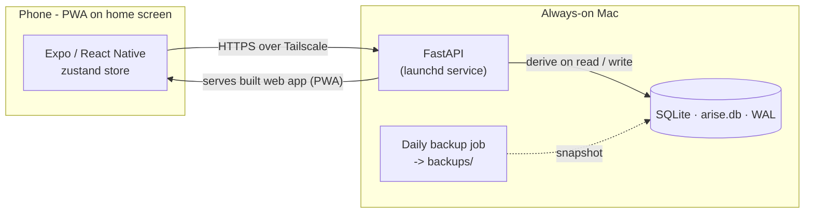
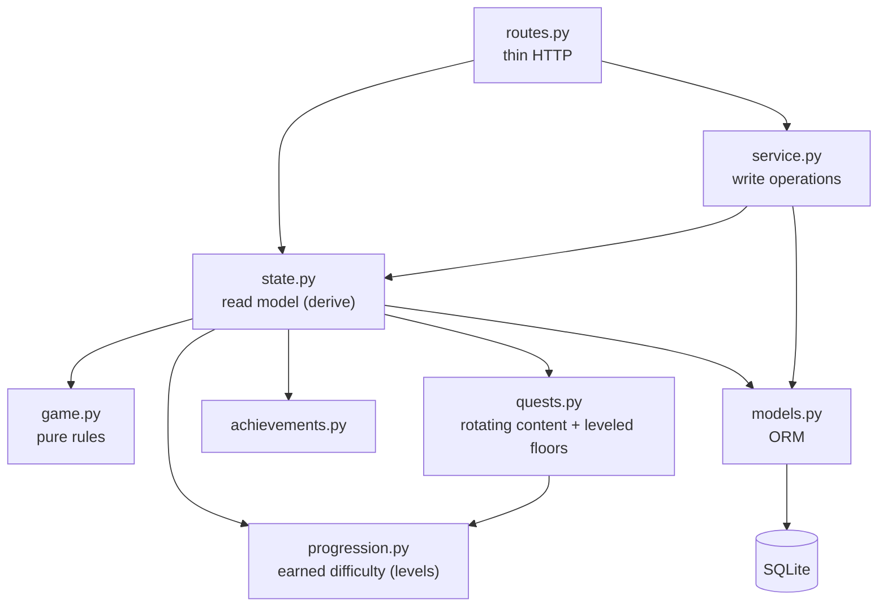

# ARISE

A personal, Solo Leveling-inspired "System" for real life — but a **gentle
guide, not a taskmaster**. Seven areas of life become seven attributes; you get
daily/weekly/side quests, XP, levels, hunter ranks (E→S), streaks, achievements
and titles. Showing up is the win, rest counts, and a missed day is never a
failure.

- **App:** Expo + React Native + TypeScript (this directory)
- **Backend:** FastAPI + SQLAlchemy + SQLite ([backend/](./backend/)) — the
  server is the source of truth; all game logic runs there.

See [DESIGN.md](./DESIGN.md) for the game design, architecture, and philosophy.

## Getting started (from scratch)

**Prerequisites** (macOS or Linux):

- [**uv**](https://docs.astral.sh/uv/) — the Python toolchain. Install with
  `curl -LsSf https://astral.sh/uv/install.sh | sh` (it fetches Python 3.12 for
  you — no separate Python install needed).
- [**Node.js**](https://nodejs.org) 18 or newer — for the Expo app.
- Optional: the **Expo Go** app on your phone, to run it on a real device.

**Steps:**

1. **Clone the repo**
   ```bash
   git clone <your-repo-url> arise && cd arise
   ```

2. **Start the backend** — terminal 1:
   ```bash
   cd backend
   uv sync          # creates .venv and installs dependencies
   uv run uvicorn app.main:app --host 0.0.0.0 --port 8000 --reload
   ```
   On first run it creates `arise.db`, seeds the quests, and serves the API at
   http://localhost:8000 (interactive docs at `/docs`).

3. **Start the app** — terminal 2, from the repo root:
   ```bash
   npm install
   npx expo start
   ```

4. **Open it** — press `w` for a browser preview, or scan the QR code with
   **Expo Go** on your phone. On a device (same Wi-Fi) the app auto-detects the
   backend; you can change the address under **Settings → System link**.

5. **(Optional) Run the tests**
   ```bash
   cd backend && uv run pytest
   ```

That's the full local setup. To run it **always-on** and add it to your phone's
home screen (launchd service + Tailscale), continue to [Deploy](#deploy-always-on).

## What it does

- **Rotating quests** — each quest is a stable "slot" whose text is picked from a
  hand-written pool by the date, so daily quests refresh each day and weekly ones
  each Monday. Free, offline, deterministic (no LLM).
- **Progression that climbs** — every attribute has a level that starts at 0 and
  grows as you show up consistently, so the challenge never stagnates. The daily
  floor ratchets up (3×10 push-ups → 5×20; a pause → a 5-min sit) and the harder areas
  move fundamentals-first (learn *how to learn* before the hard subjects; money
  *psychology* before hustle). Miss a week and it eases down gently; your all-time
  **peak never drops**, and there are no penalties.
- **Coaching steps** — every quest carries specific instructions (reps × sets,
  timed segments, prompts). Single-completion quests turn those into a tickable
  **checklist**; ticking the last step auto-completes the quest (with a floating
  undo), and the completion circle fills as you go.
- **Focus areas** — an optional set of focuses per attribute (Settings → Focus
  areas); a saved focus rotates that attribute's side quest through your set.
- **Reading loop** — the Grow floor is to read at your own pace and then log what
  you got through (Status → **Today's reading**): type the chapters however you say
  them (“5–7”, “12”, “the intro”) and the count follows along. There's no
  chapters-a-day target — those logged chapters are what carry the book toward
  finished, and once they cover it Arise asks whether you finished and what's next.
  Set the book by **searching Open Library** (free, no key) or browsing themed
  shelves (Grow / Money / Craft / Calm); picking one fills the title and estimates
  the total chapters, which is just the finish line and can be left blank.
- **Craft — the engineering ladder** — a dedicated attribute for coding, aimed
  at going mid → Senior. It climbs fundamentals-first: fluency & fundamentals →
  patterns & problem-solving → system design & architecture, with a small
  deep-work floor every day. Flip on **interview mode** (Settings) when one's on
  the horizon and its quests shift to timed DSA, mock system-design, and
  behavioural (STAR) prep.
- **AI personalisation (optional)** — set a free Gemini key and quests are
  generated and sequenced to your level; unset, it uses the handcrafted pools.
  Mandatory floors (reading, push-ups…) are always enforced regardless. See
  [DEPLOY.md](./DEPLOY.md).
- **Body — nutrition & skincare (standalone)** — a separate **Body** tab that
  isn't a stat and doesn't touch XP/streaks. Nutrition is a gentle
  calorie/protein/**fibre** target (Mifflin–St Jeor — a *range*, never a hard
  number or a "failure" state) driven by a **goal weight** with your BMI + healthy
  range shown; a **"what to eat"** list of protein- and fibre-forward foods/meals
  you can tap to log; a food log with **Open Food Facts** lookup; and a **photo
  estimate** — snap a meal and Gemini vision estimates its calories/protein/fibre
  for you to edit before logging (on-demand, needs the Gemini key). Skincare is
  an editable AM/PM **routine** seeded with a pigmentation/pores-tuned template
  plus trusted resources.
- **Inspire — capture what moved you** — a separate **Inspire** tab that turns
  motivational videos into something you keep. Paste a **TikTok, Reel, Short or
  YouTube** link and Arise fetches what was actually said (via [Supadata](https://supadata.ai) —
  a free key, 100/month) and the LLM distils it into a few **takeaways** and
  faithful **pull-quotes**. One quote resurfaces on your Status each day, beside
  your North Star — and any quote can *become* your North Star in a tap.
  Standalone: it never touches XP or streaks, and it hides unless a Supadata key
  is set. (Videos with no speech — music- or text-only — have nothing to transcribe.)
- **Recall — remembering what you read** — reading a lot and keeping little is the
  usual problem, so Arise asks it back. Log what you read under **You → Learn** (a
  book and its chapters, a Notion page, something that landed at work); each night
  the LLM distils the day into lines worth keeping, and at 07:00 the next morning
  they arrive in your inbox — **as questions, with the answers further down**. Being
  asked and briefly failing is what fixes a memory; re-reading a line you recognise
  mostly produces the feeling of knowing it. Alongside:
  - **An expanding ladder** — 1, 3, 7, 16 then 35 days. Forgetting is steepest early,
    so the rungs start close and stretch.
  - **Write it before you look** — each question has a box for your answer, and the
    real one only appears once you tap Reveal. Recognising an answer feels exactly
    like knowing it, which is how you can review for weeks and still come up blank;
    producing it cold is the only thing that tells the two apart.
  - **Leitner grading (optional)** — with your attempt sitting next to the real
    answer, tap *Knew it* / *Sort of* / *No clue*: knew it goes further out, no clue
    comes back tomorrow. Skip it entirely and each showing still climbs one rung on
    its own, so the plain ladder keeps working whether or not you ever grade.
  - **Memory hooks** — every answer comes with one: a vivid third thing that holds the
    fact and its question together. Arbitrary material (names, lists, coined terms)
    gets a mnemonic; anything you could re-derive gets the picture the idea lives in —
    the scene or analogy that makes it obvious again — rather than a mnemonic
    competing with the understanding.
  - **The book so far** — one running sentence per book, rewritten every sitting
    rather than added to. Condensing a growing pile back into one line is what turns
    notes into something you hold.
  - **The 24-hour window** — yesterday is asked first and every email invites you to
    add what else surfaced, because that detail is gone by tomorrow.

  Your reading daily and quest reflections are folded in automatically. Optional:
  needs a free [Resend](https://resend.com) key, and it hides without one. See
  [DEPLOY.md](./DEPLOY.md).
- **Your North Star** — a line you write about the life you’re reaching for,
  pinned to the top of the Status screen.
- **Rest days & forgiveness** — mark a rest day and your streak stays safe;
  the copy invites rather than commands.

## Architecture

### In plain English

Arise is made of three simple parts:

1. **The app on your phone** — the screens you tap. It doesn't remember anything
   on its own; it just shows what the "brain" sends it and passes your taps back.
2. **The "brain" on your Mac** — a small program that runs quietly in the
   background, always on. It does all the thinking (working out your quests,
   levels, streaks) and keeps everything in **one file**, like a private notebook.
3. **A private tunnel between them** (a free tool called *Tailscale*) — so your
   phone can reach your Mac from anywhere, and no one else can. Think of it as a
   locked hallway only your own devices have a key to.

```text
     YOUR PHONE          ⇄   private tunnel   ⇄          YOUR MAC (always on)
   ───────────────           (Tailscale)            ──────────────────────────
   the Arise app:                                    "the brain":
   shows your quests,                                works out quests, levels &
   takes your taps                                   streaks — all the thinking
                                                          │
                                                          ▼
                                                    "the notebook":
                                                    one file with all your
                                                    progress, backed up daily

   (optional) the brain can ask Google's Gemini AI to tailor your quests to your
   level — roughly once a day, and only if you switch it on.
```

**Why keep the "brain" on the Mac and not the phone?** Because the Mac is always
on and never loses your data. Your whole history lives in one file that *you*
own, backed up automatically every day — and it costs nothing. The phone stays a
simple window onto it, so it works the same on your phone, an old tablet, or a
browser.

### For developers

The server owns all game state; the app is a thin client that renders one
`GET /state` payload and posts actions back.



Inside the backend, reads and writes are separated by concern:



## Deploy (always-on)

The real setup runs the backend as an always-on launchd service and serves the
exported web app (PWA) over Tailscale, so the phone reaches it from anywhere with
zero config:

```bash
cd backend && uv sync && bash deploy/install.sh   # loads backend + daily backup
```

The launchd files are path-agnostic templates; `install.sh` fills in your paths.
Full walkthrough (Tailscale, iPhone home-screen install, keeping the Mac awake):
[DEPLOY.md](./DEPLOY.md).

## Tests

```bash
cd backend && uv run pytest
```

Unit tests cover the pure rules (`game.py`), the quest generator (`quests.py`)
and achievements; integration tests drive the HTTP API end to end; one test
covers the additive schema migration.

## Backups

The database is the only copy of your progress, so a launchd job
(`deploy/com.arise.backup.plist`) snapshots it daily via
[`scripts/backup_db.py`](./backend/scripts/backup_db.py) into `backend/backups/`
(last 30 kept). SQLite runs in WAL mode for safer writes. Run one by hand:

```bash
cd backend && .venv/bin/python scripts/backup_db.py
```

## Project layout

```
src/
  app/            expo-router screens (file = route)
    (tabs)/       Status · Quests · Body · Inspire · You  (You → Focus · Achievements · Settings)
  components/     flat sandy UI: QuestCard, Toast, SystemNotice, panels
  lib/            api client, date helpers
  store/          zustand store: server state + client settings
  theme.ts        sandy design tokens (colors, stat metadata)
backend/
  app/
    routes.py     HTTP endpoints (thin)
    state.py      read model — derives game state from stored rows
    service.py    write operations (complete, undo, steps, prefs, rest, reset)
    game.py       pure rules: XP curves, ranks, streaks
    quests.py     rotating content + leveled floors + content bands
    progression.py earned difficulty: per-attribute levels that climb/ease
    llm.py        optional Gemini personalisation (off without a key)
    body.py       standalone Body tools: nutrition + skincare (read + write)
    nutrition.py  calorie/protein targets (pure) + Open Food Facts lookup
    skincare.py   the seeded AM/PM routine template + resources
    books.py      book search + themed shelves via Open Library
    transcript.py video transcripts via Supadata (TikTok/Reels/Shorts)
    insights.py   Inspire: capture → distil → store; the daily pull-quote
    digest.py     Recall: learnings → highlights → the daily email
    mailer.py     one email out, via Resend
    achievements.py, models.py, schemas.py, seed.py, db.py, security.py
  scripts/        backup_db.py, send_digest.py
  tests/          pytest: unit + integration + migration
  deploy/         launchd plists (backend + backup + digest)
```
