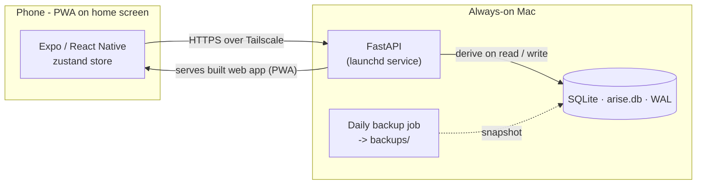
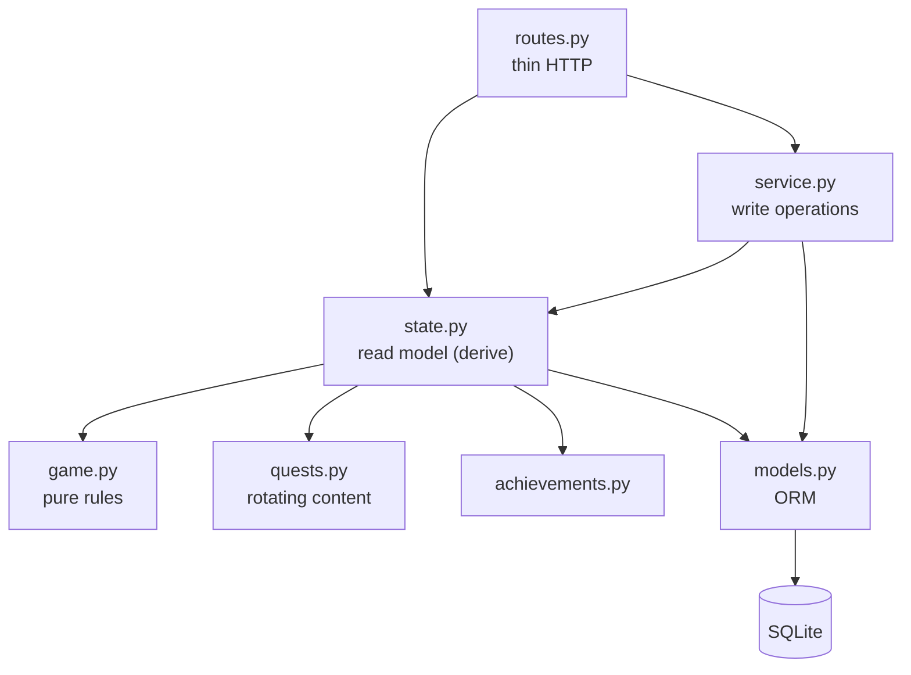

# ARISE

A personal, Solo Leveling-inspired "System" for real life — but a **gentle
guide, not a taskmaster**. Six areas of life become six attributes; you get
daily/weekly/side quests, XP, levels, hunter ranks (E→S), streaks, achievements
and titles. Showing up is the win, rest counts, and a missed day is never a
failure.

- **App:** Expo + React Native + TypeScript (this directory)
- **Backend:** FastAPI + SQLAlchemy + SQLite ([backend/](./backend/)) — the
  server is the source of truth; all game logic runs there.

See [DESIGN.md](./DESIGN.md) for the game design, architecture, and philosophy.

## Getting started (from scratch)

**Prerequisites** (macOS or Linux):

- [**uv**](https://docs.astral.sh/uv/) — the Python toolchain. Install with
  `curl -LsSf https://astral.sh/uv/install.sh | sh` (it fetches Python 3.12 for
  you — no separate Python install needed).
- [**Node.js**](https://nodejs.org) 18 or newer — for the Expo app.
- Optional: the **Expo Go** app on your phone, to run it on a real device.

**Steps:**

1. **Clone the repo**
   ```bash
   git clone <your-repo-url> arise && cd arise
   ```

2. **Start the backend** — terminal 1:
   ```bash
   cd backend
   uv sync          # creates .venv and installs dependencies
   uv run uvicorn app.main:app --host 0.0.0.0 --port 8000 --reload
   ```
   On first run it creates `arise.db`, seeds the quests, and serves the API at
   http://localhost:8000 (interactive docs at `/docs`).

3. **Start the app** — terminal 2, from the repo root:
   ```bash
   npm install
   npx expo start
   ```

4. **Open it** — press `w` for a browser preview, or scan the QR code with
   **Expo Go** on your phone. On a device (same Wi-Fi) the app auto-detects the
   backend; you can change the address under **Settings → System link**.

5. **(Optional) Run the tests**
   ```bash
   cd backend && uv run pytest
   ```

That's the full local setup. To run it **always-on** and add it to your phone's
home screen (launchd service + Tailscale), continue to [Deploy](#deploy-always-on).

## What it does

- **Rotating quests** — each quest is a stable "slot" whose text is picked from a
  hand-written pool by the date, so daily quests refresh each day and weekly ones
  each Monday. Free, offline, deterministic (no LLM).
- **Coaching steps** — every quest carries specific instructions (reps × sets,
  timed segments, prompts). Single-completion quests turn those into a tickable
  **checklist**; ticking the last step auto-completes the quest (with a floating
  undo), and the completion circle fills as you go.
- **Focus areas** — an optional set of focuses per attribute (Settings → Focus
  areas); a saved focus rotates that attribute's side quest through your set.
- **Reading loop** — a chapter a day is the mandatory Grow floor; each new week
  Arise asks if you finished your book and what to read next (a book a week).
- **AI personalisation (optional)** — set a free Gemini key and quests are
  generated and sequenced to your level; unset, it uses the handcrafted pools.
  Mandatory floors (reading, push-ups…) are always enforced regardless. See
  [DEPLOY.md](./DEPLOY.md).
- **Your North Star** — a line you write about the life you're reaching for,
  pinned to the top of the Status screen.
- **Rest days & forgiveness** — mark a rest day and your streak stays safe;
  the copy invites rather than commands.

## Architecture

The server owns all game state; the app is a thin client that renders one
`GET /state` payload and posts actions back.



Inside the backend, reads and writes are separated by concern:



## Deploy (always-on)

The real setup runs the backend as an always-on launchd service and serves the
exported web app (PWA) over Tailscale, so the phone reaches it from anywhere with
zero config:

```bash
cd backend && uv sync && bash deploy/install.sh   # loads backend + daily backup
```

The launchd files are path-agnostic templates; `install.sh` fills in your paths.
Full walkthrough (Tailscale, iPhone home-screen install, keeping the Mac awake):
[DEPLOY.md](./DEPLOY.md).

## Tests

```bash
cd backend && uv run pytest
```

Unit tests cover the pure rules (`game.py`), the quest generator (`quests.py`)
and achievements; integration tests drive the HTTP API end to end; one test
covers the additive schema migration.

## Backups

The database is the only copy of your progress, so a launchd job
(`deploy/com.arise.backup.plist`) snapshots it daily via
[`scripts/backup_db.py`](./backend/scripts/backup_db.py) into `backend/backups/`
(last 30 kept). SQLite runs in WAL mode for safer writes. Run one by hand:

```bash
cd backend && .venv/bin/python scripts/backup_db.py
```

## Project layout

```
src/
  app/            expo-router screens (file = route)
    (tabs)/       Status · Quests · Achievements · Settings
  components/     flat sandy UI: QuestCard, Toast, SystemNotice, panels
  lib/            api client, date helpers
  store/          zustand store: server state + client settings
  theme.ts        sandy design tokens (colors, stat metadata)
backend/
  app/
    routes.py     HTTP endpoints (thin)
    state.py      read model — derives game state from stored rows
    service.py    write operations (complete, undo, steps, prefs, rest, reset)
    game.py       pure rules: XP curves, ranks, streaks
    quests.py     rotating quest content + step generator
    achievements.py, models.py, schemas.py, seed.py, db.py, security.py
  scripts/        backup_db.py
  tests/          pytest: unit + integration + migration
  deploy/         launchd plists (backend + backup)
```
